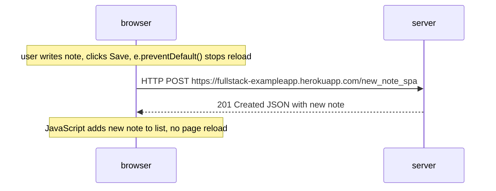

```mermaid
sequenceDiagram
    participant browser
    participant server

    Note over browser: user writes note, clicks Save, e.preventDefault() stops reload
    browser->>server: HTTP POST https://fullstack-exampleapp.herokuapp.com/new_note_spa
    server-->>browser: 201 Created JSON with new note
    Note over browser: JavaScript adds new note to list, no page reload
```
