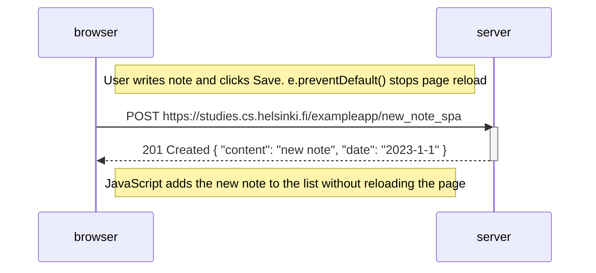

```mermaid
sequenceDiagram
    participant browser
    participant server

    Note right of browser: User writes note and clicks Save. e.preventDefault() stops page reload

    browser->>server: POST https://studies.cs.helsinki.fi/exampleapp/new_note_spa
    activate server
    server-->>browser: 201 Created { "content": "new note", "date": "2023-1-1" }
    deactivate server

    Note right of browser: JavaScript adds the new note to the list without reloading the page
```
